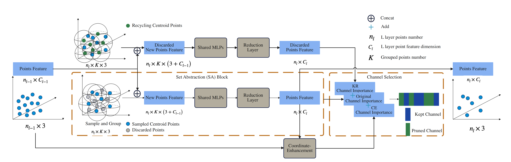

# CP³: Channel Pruning Plug-in for Point-based Networks

Official PyTorch implementation for the following paper:

**CP³: Channel Pruning Plug-in for Point-based Networks, CVPR 2023**

by *Yaomin Huang\*, Ning Liu\*, Zhengping Che, Zhiyuan Xu, Chaomin Shen, Yaxin Peng, Guixu Zhang, Xinmei Liu, Feifei Feng, Jian Tang*. 

[arXiv](http://arxiv.org/abs/2303.13097)

## Introduction

In this paper, we proposed CP³, which is a Channel Pruning Plugin for Point-based network. CP³ is elaborately designed to leverage the characteristics of point clouds and PNNs in order to enable 2D channel pruning methods for PNNs.


## Installation
There is a simple bash file to install the environment:

```
git clone $THIS_REPO.git
cd CP3
source install.sh
```
Note:  

1) the `install.sh` requires CUDA 11.3; if another version of CUDA is used,  `install.sh` has to be modified accordingly; check your CUDA version by: `nvcc --version` before using the bash file;

2) you might need to read `install.sh` for a step-by-step installation if the bash file (`install.sh`) does not work for you by any chance;

3) for all experiments, we use wandb for online logging. Run `wandb --login` only at the first time in a new machine. Set `wandn.use_wandb=False` to use this function. Read the [official wandb documentation](https://docs.wandb.ai/quickstart) if needed.

## Dataset
For specific details on downloading the dataset and preprocessing, please refer to the respective handling methods for different datasets in the [docs/examples](docs/examples/).

## Usage
Here, we take [CHIP](http://arxiv.org/abs/2110.13981) as an example to provide a detailed explanation of the workflow for the CP³ method using PointNet++ on the ScanObjectNN dataset.

### Train
1.  First, we follow the original CHIP with our CP³ to obtain the corresponding channel importance.
```
python examples/classification/generation_main.py --cfg cfgs/scanobjectnn/chip_generation_pointnet++.yaml --cof_factor 1 --dis_factor 1 --rank_factor 1  
```
2. Next, we prune the channels based on the channel importance ranking obtained in the previous step. We load the corresponding pre-trained model and fine-tune it.
```
python examples/classification/main.py --cfg cfgs/scanobjectnn/chip_generation_pointnet++.yaml --prun_rate 0.52 --pretrained_path fully_model/pre_train
```
### Test
To test the trained results mentioned above, you can use the following command to load the pre-trained model for model inference testing.
```
python examples/classification/main.py --cfg cfgs/scanobjectnn/CP3_chip_pointnetv2.yaml --prun_rate 0.52 mode=test --pretrained_path pruned_model/pre_train
```
You can download the pre-trained models after pruning with HRank and the pre-trained models after using CP³ from [HRank](https://drive.google.com/file/d/1Yps5w7DSCwtUD0BUwUX88qFBClB_D09C/view?usp=drive_link) and [HRank&CP³](https://drive.google.com/file/d/1Q-By2EcaSu8nMzDLRpY32dfpuidvehCd/view?usp=drive_link)respectively.

With the downloaded pre-trained models, you can test the pruning effects of HRank and CP³ on PointNext using the following commands respectively,
```
# Test original HRank with PointNext-S(C=32) on ScanObjectNN
python examples/classification/main.py --cfg cfgs/scanobjectnn/CP3_chip_pointnext_32.yaml --prun_rate 0.68 mode=test --pretrained_path log/pre_train/final/pointnext/c32/hrank_pointnext_c32_0.68.pth
```

```
# Test CP³ with PointNext-S(C=32) on ScanObjectNN
python examples/classification/main.py --cfg cfgs/scanobjectnn/CP3_chip_pointnext_32.yaml --prun_rate 0.69 mode=test --pretrained_path log/pre_train/final/pointnext/c32/hrank_cp3_pointnext_c32_0.69.pth
```


### Acknowledgment
This library is inspired by [PointNext](https://github.com/guochengqian/PointNeXt) and [OpenPointnet](https://github.com/guochengqian/openpoints.git). Thanks their awesome codebase.

### Code Modifications
The following modifications have been made to the original [PointNext](https://github.com/guochengqian/PointNeXt) code:
- Added configuration files required for CP³ (cfgs/scanobjectnn/*).
- Added dynamic backbone networks (chip_pointnetv2.py, chip_pointnext.py, Ppointnext.py) suitable for pruning, which are required for CP³ (openpoinys/models/backbone/).
- Modified the main training files (examples/classification/main.py, train.py).
- Added component codes required for benchmark networks (examples/classification/generation_main.py, generation.py, examples/classification/hrank_utils/*).

### Citation
If you find CP³ useful, please cite:
```tex
@inproceedings{huang2023cp3,
  title={CP3: Channel Pruning Plug-In for Point-Based Networks},
  author={Huang, Yaomin and Liu, Ning and Che, Zhengping and Xu, Zhiyuan and Shen, Chaomin and Peng, Yaxin and Zhang, Guixu and Liu, Xinmei and Feng, Feifei and Tang, Jian},
  booktitle={Proceedings of the IEEE/CVF Conference on Computer Vision and Pattern Recognition},
  pages={5302--5312},
  year={2023}
}
```
